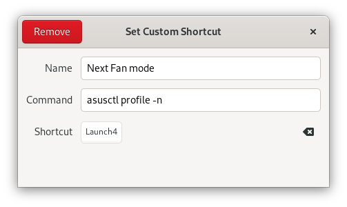

# Asusctl

## Contents

- [Pressing Fn+F5 doesn't do anything](#pressing-fnf5-doesnt-do-anything)
- [I get an error "org.asuslinux.Daemon was not provided by any .service files" when I run asusctl](#i-get-an-error-orgasuslinuxdaemon-was-not-provided-by-any-service-files-when-i-run-asusctl)
- [Why am I getting errors about my keyboard?](#why-am-i-getting-errors-about-my-keyboard)
- [It's not working!](#its-not-working)
- [I don't have any power profiles or charge control](#i-dont-have-any-power-profiles-or-charge-control)
- [How do I set a custom fan curve?](#how-do-i-set-a-custom-fan-curve)

### Pressing Fn+F5 doesn't do anything

You need to map the key-combo to an action in your desktop, like this:



### I get an error "org.asuslinux.Daemon was not provided by any .service files" when I run asusctl

The daemon isn't running, check the logs with sudo `journalctl -b -u asusd` and look for errors.

### Why am I getting errors about my keyboard?

Please ensure you are using a recent kernel. Please use at least 6.19 so that you get all the most recent patches and fixes for ASUS laptops.

### It's not working!

Check the logs with `sudo journalctl -b -u asusd` and look for errors.

### I don't have any power profiles or charge control

We recommend to use at least 6.19 so that you get all the most recent patches and fixes for ASUS laptops.

It's also possible that your laptop doesn't support this so if the kernel update doesn't solve this feel free to make a :sadface: (sorry).

### How do I set a custom fan curve?

Custom fan curves (not speaking of the built-in power profiles) are currently only supported on Ryzen ROG laptops.
The necessary kernel patches are merged since 5.17.

The format is shown [here](https://github.com/cronosun/atrofac/blob/master/ADVANCED.md#limits).

There are three fan profiles namely Quiet, Balanced and Performance to choose from. Each profile is linked to power profile and gets applied when the power profile is set. You can enable/disable the fan profiles using the following command:

```bash
asusctl fan-curve -m <profile_name> -e true/false
```

All three fan profiles can be activated at once. If no profile is activated manually then the fan curve from the BIOS is used.
To change the fan curve data for a specific profile use the following command:

```bash
asusctl fan-curve -m <profile_name> -D <fan_curve_data>
```
